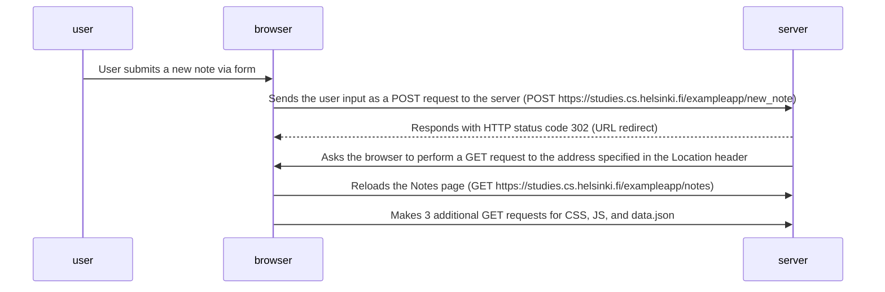

# part0

```mermaid
sequenceDiagram
    participant user
    participant browser
    participant server

    user->>browser: User submits a new note via form
    browser->>server: Sends the user input as a POST request to the server (POST https://studies.cs.helsinki.fi/exampleapp/new_note)
    server-->>browser: Responds with HTTP status code 302 (URL redirect)
    server->>browser: Asks the browser to perform a GET request to the address specified in the Location header
    browser->>server: Reloads the Notes page (GET https://studies.cs.helsinki.fi/exampleapp/notes)
    browser->>server: Makes 3 additional GET requests for CSS, JS, and data.json


```

```mermaid
sequenceDiagram
    participant user
    participant browser
    participant server

    user->>browser: User submits a new note via form
    browser->>server: Sends the user input as a POST request to the server (POST https://studies.cs.helsinki.fi/exampleapp/new_note)
    server-->>browser: Responds with HTTP status code 302 (URL redirect)
    server->>browser: Asks the browser to perform a GET request to the address specified in the Location header
    browser->>server: Reloads the Notes page (GET https://studies.cs.helsinki.fi/exampleapp/notes)
    browser->>server: Makes 3 additional GET requests for CSS, JS, and data.json


```
